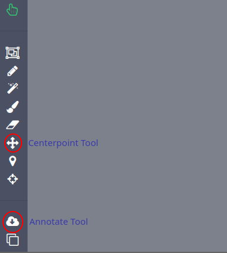
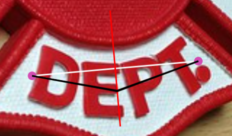
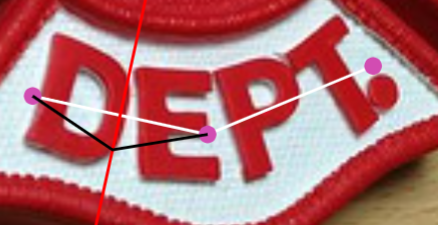
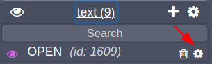
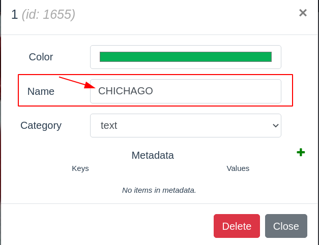
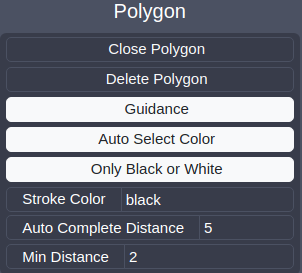

# Text-Annotator(候选命名)

Text-Annotator是一款适用于OCR领域的半自动化图形标注工具，相较于现有的OCR标注工具（PPORCLabel，Labelme，T3等），Text-Annotator拥有以下优势：

- Text-Annotator基于COCO-Annotator开发，是一个支持多人协作的Web端图像标注工具，同时拥有友好的图形化交互界面，以及全面的工具包，包括：Bounding box工具、Polygon工具和画刷工具等。 
- 搭载更先进的预标注算法。本工具搭载有ABCNet端到端文本检测和识别算法，较业界工具，如百度PPOCRLabel，拥有更优异的文本标注能力。
- 首个搭载人机协作标注算法的工具。本工具搭载有交互式标注算法，SBE模型，用户只需要标注文本中心线即可完成不规则文本的标注，相较于Polygon标注，标注效率更高。
- 首个搭载置信度校准的文本识别模型的工具。本工具所搭载的置信度校准的文本识别模型通过置信度高低指示用户是否需要对识别标注进行校验，避免全数据集校验，加快校验效率。

## 工具演示

[[演示视频](https://www.bilibili.com/video/BV1f5411T78s/)]

# Quick start demo

- 进入标注系统：116.57.73.173:8200
- 使用游客账户进行登录
    - 用户名: guest
    - 密码: guest

- 点击进入已创建的数据集，选择一张图片进行标注

## 工具具体位置

## 预标注

- 点击左下角的`Image Settings`（齿轮按钮），更改地址为`/api/models/detect_model`，再点击左侧工具`Annotate Tool`，即可调用默认模型ABCNet。

## Centerpoint Tool

- 中心线标注算法，即文本检测识别的半自动标注算法。具体使用方法如下：

1. 点解右侧“+”符号按钮创建新的标注，并点击左侧工具栏的`Centerpoint Tool`

2. 鼠标左键依次点击每个文本行的两个端点，先标注文本中心线的端点

3. 再根据文本弯曲程度，依次标注中间的几个点

4. 完成标注后，按下`z`键即可调用算法(或者标注点数达到**5个点**，会自动调用算法)

- 注: 识别出的文本会显示在右侧列表名字中，若识别结果有误，点击列表中每个标注项目右边的设置（齿轮）按钮，修改`Name`,即可更改对应的标注文本。

# 任务发布者说明

## 开始

    cd coco-annotator
    docker-compose -f docker-compose.dev.yml up --build

访问8200端口即可进入标注系统

## 使用

- 创建用户
- 创建类别
- 创建数据集
- 导入图片
- 标注图片
- 导入/导出标注

## 创建用户

### 用户权限

Admin - 拥有最高权限

Owner - 数据集的创建者

User - Owner/Admin可选择与User共享数据集

| 权限 | User | Owner | Admin |
|-------------|:----:|:-----:|:-----:|
| 查看图片 | ✔️ | ✔️ | ✔️ |
| 创建/编辑/删除标注 | ✔️ | ✔️ | ✔️ |
| 导入标注 | ✔️ | ✔️ | ✔️ |
| 分享/下载/删除数据集 | | ✔️ | ✔️ |
| 添加/下载/删除图片 | | ✔️ | ✔️ |
| 导入图片 |  | ✔️ | ✔️ |
| 更改其他用户的数据集 | | | ✔️ |

## 创建类别

    上方标题栏-->Catagories-->Create-->Name->输入类别名字->Create Category

## 创建数据集

    上方标题栏->Datasets->Create->Default Categories->选择已有类别

创建数据集后，在Dataset界面可以看到新建的数据集，点击右下角三点可以：

- edit: 更改默认类别
- delete： 删除数据集
- share： 将该数据集共享给已有用户 

## 导入图片

**数据集位置**在`coco-annotator\datasets`

创建数据集后，找到想要导入图像的数据集文件夹，将图片复制到该文件夹中，然后点击Dataset页面的`refresh`按钮即可

## 标注图片

本标注系统提供一系列标注工具用于标注图片，具体用法在后面部分介绍，标注时先在右侧选中需要标注的类别，点击`+`**创建新的标注**，即可激活左侧标注工具。

另外还提供预标注算法，首先点击左下方`Image Settings`（齿轮按钮），在api栏输入模型地址，**默认的ABCNet地址**为`/api/model/detect_model`，完成后点击左下方的预标注按钮即可调用预标注算法。

注：调用算法前**请确认你的数据集已包含相应的类别**，如调用ABCNet请保证数据集中包含text类

## 导入\导出标注

本标注系统所有标注均使用**coco格式**保存。进入相应数据集后，点击左侧的`import\export`即可导入\导出标注

注：文本识别结果保存在coco文件的`["annotations"]["metadata"]`中

## 标注文本

- 先在category里**创建名为"text"的类**

    `上方标题栏-->Catagories-->Create-->Name->输入text->Create Category`

- 并添加到你的数据集中

    `上方标题栏->Datasets->Create->Default Categories->输入text`
- 后续即可使用Centerpoint Tool和ABCNet进行文本标注

---

# 标注者说明

## 标注工具简介

- 鼠标移动至左侧标注工具图标上，可查看工具名字
- 下文表格中选项均指右下方的选项栏中的选项，如下图为Polygon Tool的选项

### Selection Tool

Selection Tool（选择工具）是默认的初始化工具，该工具可以：

- 长按以拖动图片
- 选择已有的标注框，查看标注内容

| 选项 | 类型 | 描述 |
| ------ | ---- | ----------- |
| Show hover Text | Toggle | 鼠标移动至标注框，悬浮显示标注内容（关闭可提高性能） |

### BBox Tool

矩形框标注工具，点击对角线两点即可标注一个矩形框

### Polygon Tool

多边形标注工具，可以自由点击多个点作为多边形标注框的顶点，当标注的多边形接近封闭时，可自动形成闭合多边形（连接最后一个点与第一个点）

| 选项 | 类型 | 描述 |
| ------ | ---- | ----------- |
| Guidance | Toggle | 是否生成引导线（引导线会随着鼠标移动） |
| Delete Polygon | Operation | 移除当前选择的多边形 |
| Complete Distance | Integer | 判断是否完成自动封闭多边形的最小距离 |

### Magic Wand Tool

魔术棒工具，用于实现目标分割。

| Option | Type | Description |
| ------ | ---- | ----------- |
| Threshold | Number | 判断像素是否相似的阈值 |
| Blur | Number | 轮廓模糊程度 |

### Eraser/Brush Tool

刷子工具，使用该工具可以涂抹标注区域，最终涂抹完成得到的区域即为标注框，可以按`[`或者`]`调整刷子大小。

橡皮擦工具，与刷子配套使用，可以擦除已经涂抹过的区域。

### Centerpoint Tool

中心线标注算法，即文本检测识别的半自动标注算法。具体使用方法如下：

1. 先标注每个文本行的两个端点（中心线端点）
2. 再根据文本弯曲程度，依次标注中间的几个点
3. 完成标注后，按下`z`键即可调用算法

- 注: 识别出的文本会以`{"name":text}`的形式存在`metadata`里，即以每个标注的名字的形式存在，若识别结果有误，点击每个标注右边的设置（齿轮按钮）即可更改对应的标注文本。

### Keypoints Tool

关键点标注工具，通常用于人体关键点标注。在创建类别时可以指定关键点部分，使用该工具时可以按照指定部分完成关键点连接。

### DEXTR

DEXTR为半自动标注算法，使用时点击待标注物体的上下左右四个点（可以不按顺序），标注完四个点后会自动调用算法，形成分割区域。 

### Annotate Tool

预标注工具，在指定设置里的`ANNOTATE API`后，调用此工具即可调用预标注模型

#### ABCNet

端到端的文本检测识别算法。

### Copying Tool

可复制指定图片的标注到另一张图片

---

### Modes

#### Segment Mode

分割模式，此为默认模式，用于目标检测、分割。

#### Label Mode

标签模式，此模式用于对每张图片打上单一标签。

### Undo

撤销上一步操作

### Save

保存当前标注
